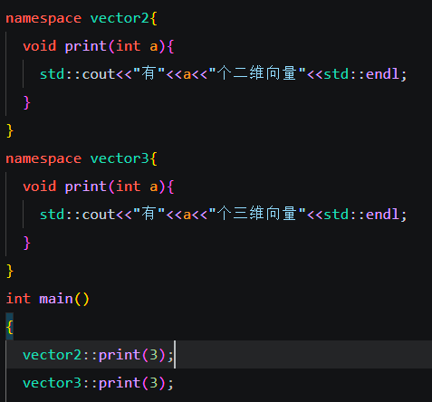

## 命名空间namespace

命名空间这个东西创造出来的目的，就是让编译器能够区分名字相同但功能略有差别的函数。我们在命名函数的时候大多没有什么创新，功能相加我们就命名add(),打印就是print()或者LOG(),加入你有两个类，都有各自的log方法，但是你不想取不同的名字，那么为了区分，我们就引入了命名空间。

声明：

```c++
namespace 空间的名字{
    //.......
}
```

下面一个简单的例子



在调用对应函数时要声明命名空间才能调用对应的函数

当然也可以使用using指令

```c++
using namespace vector2;
print(3);//默认调用vector2中的函数
```

using也可以声明某一特定的函数

```c++
using vector3::print;
print(3);
vector2::print(3);//在使用其他空间的函数也要声明空间
vector3::func();//使用统一空间其他函数也要声明
```

此外，命名空间的声明可以是不连续的，也就是一个空间的组成部分可以分散在不同文件中

最后，命名空间是可以嵌套的

```c++
namespace space1{
	namespace space2{		
	}

}
```

调用时space1::space2就行

此外，如果代码中有全局变量与命名空间的变量同名，其实这个全局变量也是有命名空间的
	::a
	space1::a
	space1::space2::a

三个a不一样，是不同命名空间的，第一个是全局变量