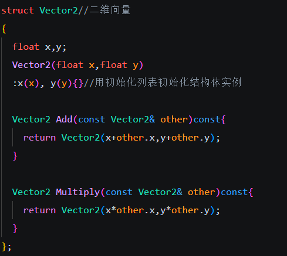
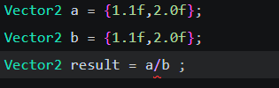
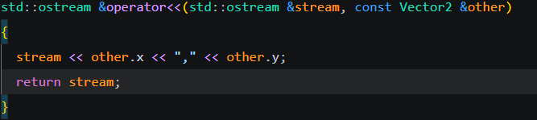

**操作符和操作符的重载**

c++中操作符（运算符）有很多类型

简单的有+ - * / ++ --

表示关系和逻辑的==  != && || >=  > <= <

还有位运算符& | ^ ~ << >>操作二进制位

new delete 等关键字也算操作符

() {} [] 也属于

**重载的运算符（operator）**

重载：简单来说就是改变已有的运算符的意义和运算方式，使得操作更直观，但操作是隐藏在重载代码里面的，可能有误用的风险

运算符本质上就是*函数*的标志

以下面的结构体为例

<u>***(注意在函数传递对象的时候一定要写  const 类名& 参数名 )***</u>



要对二维向量进行加减，只需要调用Add函数就可

```c++
Vector2 a = {1.1f,1.2f};
Vector2 b = {1.2f,3.2f};
Vector2 result1 = a.Add(b);
```

但是这里代码的可读性并不好，于是就可以使用操作符的重载，操作符重载函数的函数名必须是 operator@ (@是运算符的占位)，如下

```c++
Vector2 operator+(const Vector2& other)
{
return Add(other);
}
```

这里是直接调用了Add实现相加功能，于是上面的加法例子可以改成


```c++
Vector2 result1 = a + b;//意义一目了然
```

可以发现，重载的意义就在于让函数更具有可读性

下面是简便写法

```c++
Vector2 operator+(const Vector2& other)
{
	return Vector2(x+ other.x, y + other.y);
}
```

当我们要禁止某些操作，比如我们不想让用户对我的二维向量使用除法，可以利用重载

```c++
Vector2 operator/(const Vector2 &other) = delete;
```

此时会出现



编译器会报错

让我们来看cin和cout

一般cout写法,使用了 << 操作符

```c++
std::cout<< "123"<<std::endl;
```

如果我们要cout我们的vector2就会报错，这就需要重载



注意

```c++
cout << a << b << c;
// 等价于
((cout << a) << b) << c;
// 每次返回 ostream&，继续下一步
```

现在就可以按你的标准输出了，跟java重写tostring()一样。

最后，我们在自己的类里经常涉及比较，java里自己的类都会写一个equal()函数来实现这个功能，而c++可以直接重载==来实现这个功能

```c++
bool operator==(const Vector2 &other){
  return x == other.x && y == other.y;
 }//==
bool operator!=(const Vector2 &other){
  return !(*this == other);
 }//!= 的简单写法
```

