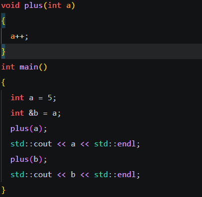

## ***引用(Reference)***

本质上，指针和引用是一个东西，引用是一个已存在变量的别名，所以初始化的时候引用必须绑定一个变量，并且以后这个绑定关系无法改变。

```c++
int a = 5;
int& ref = a;
```

指针和引用区别在于

首先指针是一个地址，而引用的对象是一个变量。

在底层，引用实际上会被编译器直接优化为操作所引用的对象，所以不会占用内存

**&操作符，左值表示引用，右值表示<u>取地址</u>**

### 在函数中使用

一般的函数是值传递



在上面这个测试中，发现输出值都是5，因为函数形参本质是创建一个新的变量承接 a 和b的值，函数结束出栈，保存的变量也会消失

但是当函数的形参如下

```c++
void plus(int& a)
{
  a++;
}
```

执行同样的main函数 会发现输出为6和7，这和形参设置为指针具有同样的效果，但引用形参只要求输入内容是变量还是引用，但不能是指针。这是因为本质上是在函数执行是，底层是先生成引用变量来承接输入量，引用变量可以引用另一个引用或变量,但不能引用另一个指针。