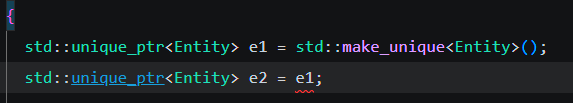
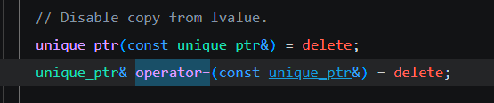

智能指针有这么几种

```c++
std::unique_ptr
std::shared_ptr
std::weak_ptr
```

在创建新的对象时，一般会使用new关键字，但是往往会忘记delete，smart pointers就是一种不需要delete的创建对象的方法

简单来说，smart pointer就是普通的pointer加上一层包装,用下面的类进行实验

```c++
class Entity
{
public:
  Entity()
  {
    std::cout << "entity created" << std::endl;//构造方法
  }
  ~Entity()
  {
    std::cout << "entity distroyed"<< std::endl;//摧毁方法
  }
};
```

**std::unique_ptr**

独特指针是一个scoped pointer，意味着只能在特定作用域下发挥作用，出作用域就自动调用delete

创建unique ptr

```c++
int main()
{
  {//在这里的作用域用来限制创建的e1
    std::unique_ptr<Entity> e1 = std::make_unique<Entity>(); // 调用构造函数进行构造，括号内是构造时的参数
    // 这里的e1就是创建的entity的指针，可以进行类方法的调用
    e1->Print();
  }
}//当程序运行到此行，e1自动调用delete并且执行~Entity（）破坏器
```

最好使用std自带的make_unique<>()方法，e1作用与指针相同

当我们想要复制指针的时候就会出现一些问题



查阅源代码，发现



对于‘=’，底层是直接禁止了这个操作，因为如果直接复制指针，当e1和e2在同时执行destructor时，会将同一片内存删除两次，导致系统崩溃（见Copying and copy constructors）.所以如果我们想要使用复制，就需要用到共享指针

**std::shared_ptr**

```c++
std::shared_ptr<Entity> sharedEntity = std::make_shared<Entity>();//创建被引用（分享）的ptr
std::shared_ptr<Entity> e0;//只有sharedPtr之间才能复制
e0 = sharedEntity;
```

共享指针除了本身可以当做指针正常使用之外，还可以保证被共享指针的存活