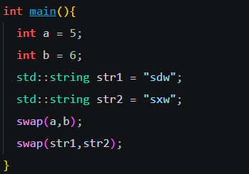
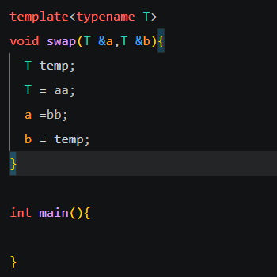

## 模板

我们知道，可以用函数的重载，使得一个函数名能够对不同形参执行操作，如果我们要进行交换操作， 一般的写法如下

```c++
void swap(int &a, int &b){
	int temp;
	temp = a;
	a = b;
	b = temp;
}
```

但是如果我们要对string double long等不同数据类型的变量进行相似操作的话，需要用函数重载写很多相似的代码，在这里c++提供了一种合适的方法，就是运用模板，本质上模板就是让c++的编译器帮你写代码。

<u>模板分为函数模板和类模板</u>，先讨论函数模板，用模板定义的swap函数如下

```c++
template<typename T>//typename可以用class替换，都是关键字，typename可能会更不易弄混
void swap(T &a,T &b){
  T temp;
  T = a;
  a =b;
  b = temp;
}
```



写完main的代码，发现没有报错，并且能够达到交换的效果

如何实现的呢？本质上就是编译器在读到我们调用swap函数时，比如swap（a，b），自己在底层自己写了如下的代码并执行。

```c++
void swap(int &a,int &b){
  int temp;
  temp = a;
  a =b;
  b = temp;
}
```

模板就是这个意思，我们给了编译器一个蓝图，让它在面临不同的类型变量时自己完成相应的代码，所以我们写模板，就是让编译器自己搞函数重载那一套，不用我们自己手写。

同样，如果我们不调用任何模板函数，那么在编译的时候，写的模板函数的代码在底层是不存在的



可以看到，代码中aa bb是未定义的变量名，但是没有红色报错标志，这是因为编译过程中这段代码根本不存在。如果调用了编译后就会看到报错。

然后是类模板

定义如下

```c++
template<模板参数表>
class 类名{
。。。。
}；
```

比如

```c++
template<typename T, int a>
class my_vector{
public:
	my_vector(){
	vector = new T[a];
	}
	~my_vector(){
	delete vector;
	}
privete:
	
	int vector_size;
	T* vector;
};
```

在创建类对象时

```c++
my_vector<int,3> arr;
```

实际工作中，模板用的好确实会减少很多代码量，但是模板的缺点在于它的执行是隐藏在底层的，在众多数据类型中，不可避免偶尔会出现运行错误，并且这样的错误会令人十分困惑，是否使用template见仁见智