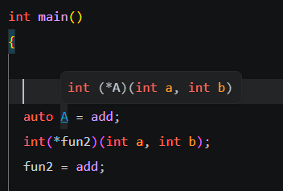
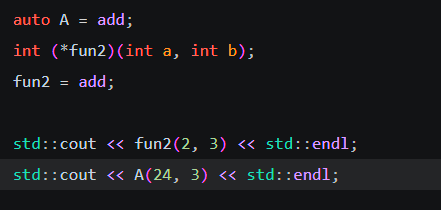
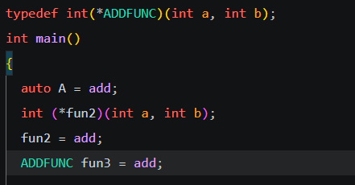
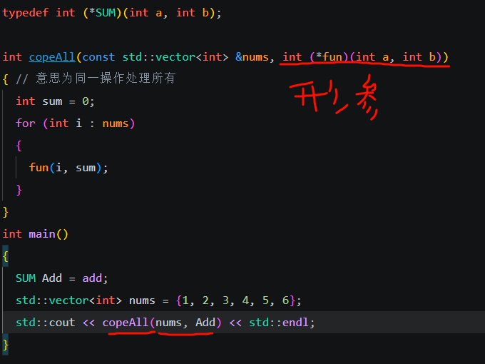
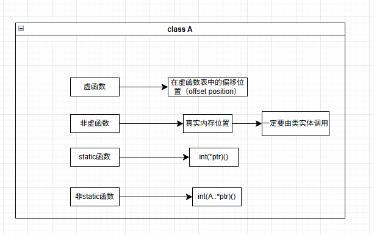

## 函数指针

c++中函数存放在内存的代码区内，也有自己的地址，而函数指针就是将函数的地址赋值给指针变量，这个变量也能够执行函数的功能。

```c++
int add(int a, int b){
	return a+b;
}
//定义函数指针
auto A = add;//1.
int(*B)(int a,int b);//2.第一个int指返回值类型，B是指针变量的名字，int a是形参
B = add;//赋值
```



并没有报错，并且可以看到A的类型和fun2一样，auto的技巧可以使得函数指针定义更直白可读，因为本质上正常定义中，fun2是变量的名字，不是什么参数，而int(*)是这个变量的类型，与常规变量和类型的关系不一样，指针变量同样可以对函数进行调用



运行结果如下


除了用auto简化，也可以用typedef简化



同样可以看出，*后面的是变量名，而其他的是变量的类型

同样函数指针可以作为函数的参数



一目了然，当然函数具体逻辑还要修改，这里不花时间。

同样有了指针，指针数组自然能够实现

接下来是比较特殊的函数指针，当函数指针指向类成员函数的时候，就成了***类成员函数指针（member function pointer）***

函数指针是承接函数的地址，本质上是函数代码开头的地址，也叫做代码指针，但是类成员函数指针与代码指针不同，类成员函数指针涉及到c++多态继承，虚继承的问题，因为类中的虚函数没有实际代码，所以<u>指向虚函数时是指向虚函数在虚函数表中的偏移位置</u>，对于非虚函数则是<u>指向真实地址</u>，同样 对于static函数和非static函数，指针变量的类型同样有所区别，在下表中展示



