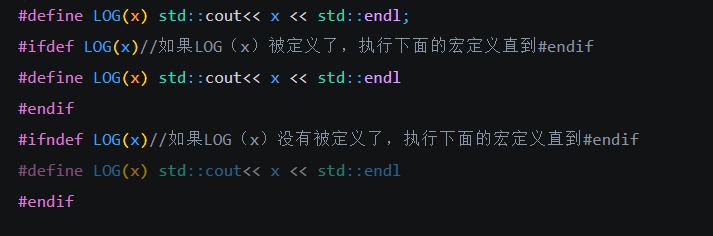
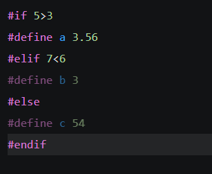

## 宏(Macro)#define

也叫做c预处理器，发生在编译过程开始的预处理阶段。编译器在底层会把#define这一行的代码进行替换，本质上是一个文本替换工具。被定义的量属于常量，编译器会将其作为关键字处理，只有在其单独出现时才会执行替换指令

有如下几种处理器指令#define  #include  #undef  #ifdef  #ifndef  #if  #else  #elif  #endif #error #pragma

### 1.#define

用于定义宏常量 或者宏函数

```c++
#define PI 3.14
#define LOG(x) std::cout<< x <<std::endl 
```

可以看到#define使用得当可以增加代码可读性

注意：#define只以所在的一行为单位进行替换，如果代码写到下一行则不会替换，要使得代码换行要用“\”，\可以消除前面的一个符号

```c++
#define LOG(a){
	std::cout<< a << std::endl;
}//不会成功编译

#define LOG(x){
\std::cout<< a << std::endl;
\}//成功编译
```

### 2.#ifdef和#ifndef 
两者都要配合#endif使用



### 3.#if #elif #else

#if (条件) 语句 //如果条件满足 执行语句，要与#endif搭配使用,三个用法简单




