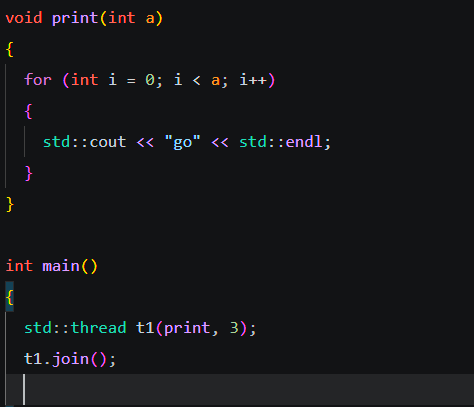

## 线程(threads)

线程是程序执行的基本单元，允许程序同时执行多个任务，c++提供了<threads>库为多线程编程提供支持

多个线程可以在一个进程中独立运行

线程共享进程的地址空间，文件描述符、堆和全局变量等资源，但是每个线程拥有自己的栈，寄存器和程序计数器

### 并发(concurrency)和并行(parallelism)

并发：多个任务在时间片段内交替进行

并行：多个任务在多个处理器核上同时执行

程序中main()的执行也是分配了一个线程实现的。

### 线程创建：

```c++
std::thread 线程名(callable,args...);
```

callable是指可以被调用的量，包括lambda表达式，函数指针，单纯的函数。

args表示传入参数列表

线程创建后使用.join()方法用于让执行main()的线程等待t1线程完成执行。如果不调用 join() 或 detach() 而main结束后会直接销毁线程对象，会导致程序崩溃。（.join()让这个线程插队到main线程前面执行,不然两者会同时进行）



也可以调用detach()函数，使得线程运行在程序后台，不让主程序等待。

线程运行函数的结果一般会被忽略，如果要承接返回值，一般通过传入引用的对象进行修改，此外thread接收非引用参数时同样是值传递，浅复制。**<u>一个线程只能join一次</u>**

传入引用参数需要用std::ref()包装

	t1.join();
	t2.join();
	t3.join();
	t4.join();

这么写意思是让四个线程同时进行，也就是让主线程等待四个线程同时进行完毕，而不是t1完毕后执行t2,所以程序最大运行时间取决于用时最长的那个线程。


为了保证线程的唯一性，线程对象的构造函数没有复制构造，<u>只有移动构造</u>。

所以如果<u>传递线程作为参数</u>，那么在传入实参时应写成**std::move(t1);**,这样就能够正常传递。书写形参时应该如下

```c++
void func(std::thread&& t1){};
func(std::move(t1));
```

（这里可以复习一下移动构造，在函数中形参使用右值传递，则实参使用std::move()函数进行转换，在底层，编译器会创建新的thread变量，并通过移动构造函数，对t1进行移动构造,此时t1能够被正常销毁iv）