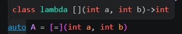
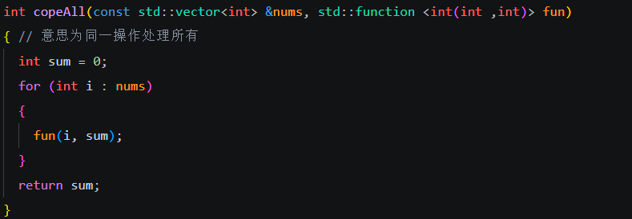
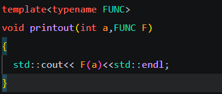

## lambda表达式

lambda表达式 或者匿名函数，就是一些没有函数名的函数

声明

```c++
[capture](parameters)->return-type{body}
```

最常用的就是第三种，解释一下几个名词

捕获（capture）:是一系列符号，表示对传入变量的捕获方式(下面摘自菜鸟教程)

	[]      // 沒有定义任何变量。使用未定义变量会引发错误。
	[x, &y] // x以传值方式传入（默认），y以引用方式传入。
	[&]     // 任何被使用到的外部变量都隐式地以引用方式加以引用。
	[=]     // 任何被使用到的外部变量都隐式地以传值方式加以引用。
	[&, x]  // x显式地以传值方式加以引用。其余变量以引用方式加以引用。
	[=, &z] // z显式地以引用方式加以引用。其余变量以传值方式加以引用。



parameters：形参列表

return:返回值的数据类型

lambda函数可以作为形参传入其他函数，有三种方式

1.形参为函数指针，lambda可以传入，但是不能有捕获，即[]

2.可以用std::function是一个模板类，可以存储、调用和复制任何可调用对象，比如函数、lambda 表达式或函数对象。



std::function<返回类型（形参列表）> 函数名；

这样可以传入任意lambda函数

3.可以用模版



这样也可以传入任意lambda函数

